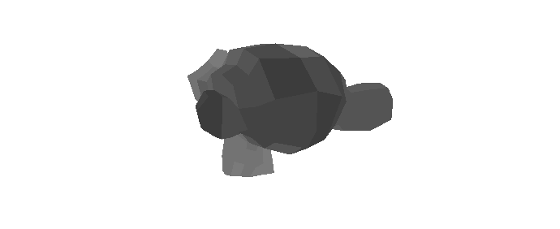
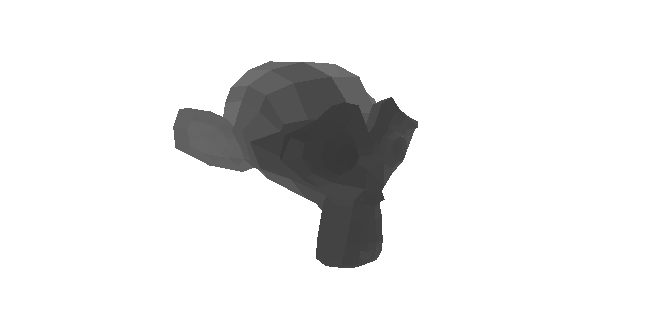

# WebGPU Compute Rasterizer

This is a basic implementation of a rasterizer running on WebGPU compute shaders. It currently supports loading a list of triangles from a (very basic) glTF model and rendering it, with shading based on each triangle's distance to the camera.

I built this to create a simple template for exploring compute-based rendering techniques. Initially inspired by [Rendering Point Clouds with Compute Shaders and Vertex Order Optimization](https://github.com/m-schuetz/compute_rasterizer).

See:

* [How to Build a Compute Rasterizer with WebGPU](how-to-build-a-compute-rasterizer.md) for a step by step guide on building your own version of this. 
* Or [Code Overview](code-overview.md) for a brief walkthrough of the code & implementation. 

## Building locally

Run `npm install` and `npm run dev`. Then open `localhost:3000`.

You must use a browser that supports WebGPU. See the [setup instructions in this article](https://alain.xyz/blog/raw-webgpu#setup).